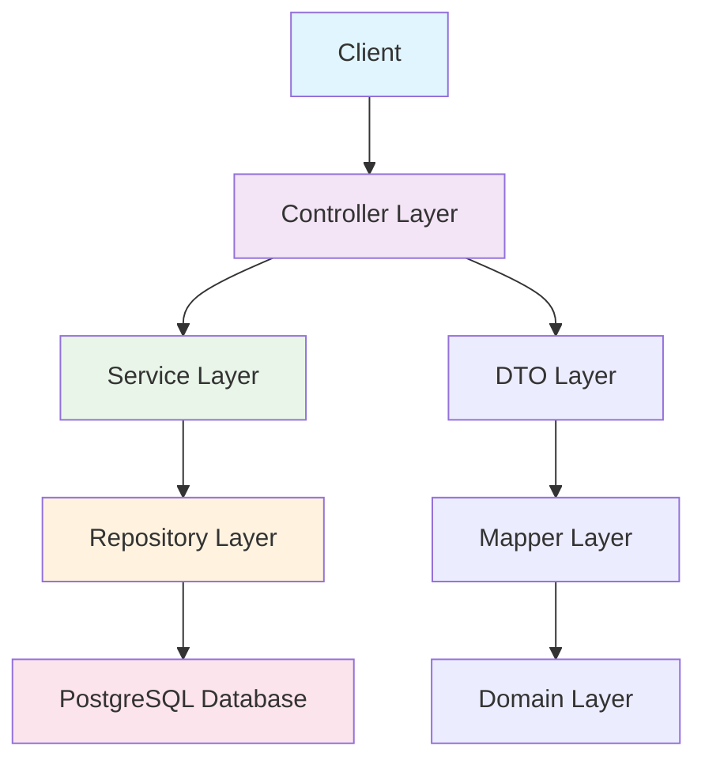
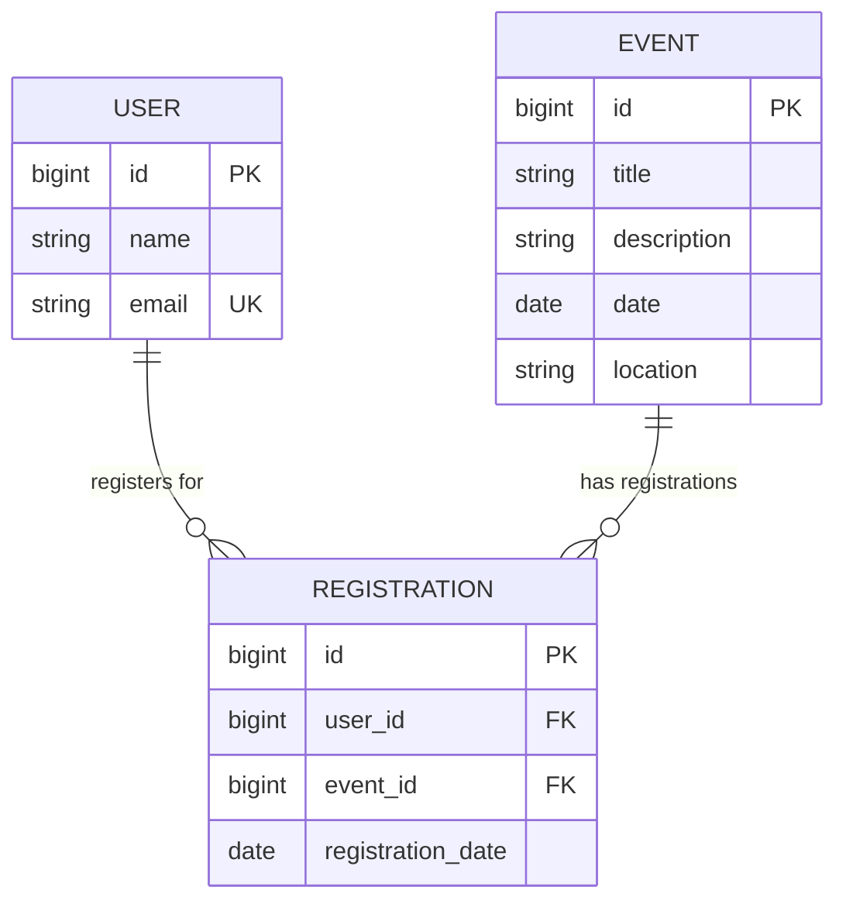

# 🎉 Event Ease - Event Management System

<div align="center">


**A comprehensive event management system built with Spring Boot**

[Features](#-features) • [Quick Start](#-quick-start) • [API Documentation](#-api-documentation) • [Database Schema](#-database-schema)

</div>

---

## 📋 Table of Contents

- [🎯 Overview](#-overview)
- [✨ Features](#-features)
- [🚀 Quick Start](#-quick-start)
- [🏗️ Architecture](#️-architecture)
- [📊 Database Schema](#-database-schema)
- [🔌 API Documentation](#-api-documentation)
- [🧪 Testing](#-testing)
- [🛠️ Configuration](#️-configuration)
- [📝 Contributing](#-contributing)

---

## 🎯 Overview

**Event Ease** is a robust event management system that allows users to create, manage, and register for events. Built with modern Spring Boot architecture, it provides a complete RESTful API for event management operations.

### 🎪 What can you do?
- 👥 **User Management**: Create and manage user profiles
- 🎫 **Event Management**: Create, update, and delete events
- 📝 **Registration System**: Register users for events
- 🔍 **Query Operations**: Advanced filtering and search capabilities

---

## ✨ Features

<table>
<tr>
<td width="50%">

### 🔐 **User Management**
- ✅ User registration and profile management
- ✅ Email validation
- ✅ User authentication ready

### 🎪 **Event Management**
- ✅ Create and manage events
- ✅ Event scheduling with date validation
- ✅ Location and description management
- ✅ Event capacity tracking

</td>
<td width="50%">

### 📋 **Registration System**
- ✅ User-Event registration mapping
- ✅ Registration date tracking
- ✅ Bulk registration queries
- ✅ Registration management

### 🏗️ **Technical Features**
- ✅ RESTful API design
- ✅ PostgreSQL database integration
- ✅ Data validation with Bean Validation
- ✅ Exception handling

</td>
</tr>
</table>

---

## 🚀 Quick Start

### Prerequisites

```bash
☑️ Java 21 or higher
☑️ Maven 3.6+
☑️ PostgreSQL 12+
☑️ Your favorite IDE (IntelliJ IDEA recommended)
```

### 🔧 Installation

1. **Clone the repository**
   ```bash
   git clone https://github.com/your-username/event-ease.git
   cd event-ease
   ```

2. **Setup PostgreSQL Database**
   ```sql
   CREATE DATABASE event_ease;
   CREATE USER postgres WITH PASSWORD 'jdbc';
   GRANT ALL PRIVILEGES ON DATABASE event_ease TO postgres;
   ```

3. **Configure Application**
   ```properties
   # Already configured in src/main/resources/application.properties
   spring.datasource.url=jdbc:postgresql://localhost:5432/event_ease
   spring.datasource.username=postgres
   spring.datasource.password=jdbc
   ```

4. **Run the Application**
   ```bash
   mvn spring-boot:run
   ```

5. **Verify Installation**
   ```bash
   curl http://localhost:8080/api/events
   # Should return: []
   ```

---

## 🏗️ Architecture



### 📁 Project Structure

```
src/main/java/com/event_ease/event_ease/
├── 🎮 controller/          # REST Controllers
│   ├── EventController.java
│   ├── UserController.java
│   └── RegistrationController.java
├── 🏢 service/             # Business Logic
│   ├── EventService.java
│   ├── UserService.java
│   ├── RegistrationService.java
│   └── Impl/               # Service Implementations
├── 🗄️ repository/          # Data Access Layer
│   ├── EventRepository.java
│   ├── UserRepository.java
│   └── RegistrationRepository.java
├── 🏗️ domain/              # Entity Classes
│   ├── Event.java
│   ├── User.java
│   └── Registration.java
├── 📦 dto/                 # Data Transfer Objects
│   ├── EventRequestDTO.java
│   ├── EventResponseDTO.java
│   ├── UserRequestDTO.java
│   ├── UserResponseDTO.java
│   ├── RegistrationRequestDTO.java
│   └── RegistrationResponseDTO.java
├── 🔄 mapper/              # Entity-DTO Mappers
│   ├── EventMapper.java
│   ├── UserMapper.java
│   └── RegistrationMapper.java
└── ⚠️ exception/           # Exception Handling
    ├── GlobalExceptionHandler.java
    ├── ResourceNotFoundException.java
    └── InvalidInputException.java
```

---

## 📊 Database Schema

### 🗃️ Tables Overview

<table>
<tr>
<td width="33%">

#### 👥 **users**
```sql
CREATE TABLE users (
    id BIGSERIAL PRIMARY KEY,
    name VARCHAR(255) NOT NULL,
    email VARCHAR(255) NOT NULL UNIQUE
);
```

</td>
<td width="33%">

#### 🎪 **events**
```sql
CREATE TABLE events (
    id BIGSERIAL PRIMARY KEY,
    title VARCHAR(255) NOT NULL,
    description TEXT,
    date DATE NOT NULL,
    location VARCHAR(255) NOT NULL
);
```

</td>
<td width="33%">

#### 📝 **registrations**
```sql
CREATE TABLE registrations (
    id BIGSERIAL PRIMARY KEY,
    user_id BIGINT NOT NULL,
    event_id BIGINT NOT NULL,
    registration_date DATE NOT NULL,
    FOREIGN KEY (user_id) REFERENCES users(id),
    FOREIGN KEY (event_id) REFERENCES events(id)
);
```

</td>
</tr>
</table>

### 🔗 Entity Relationships



---

## 🔌 API Documentation

### Base URL
```
http://localhost:8080/api
```

---

## 👥 User Management API

<details>
<summary><b>🔍 Click to expand User API endpoints</b></summary>

### 📋 Get All Users
```http
GET /api/users
```

**Response:**
```json
[
    {
        "id": 1,
        "name": "John Doe",
        "email": "john.doe@example.com"
    }
]
```

### 🔍 Get User by ID
```http
GET /api/users/{id}
```

**Response:**
```json
{
    "id": 1,
    "name": "John Doe",
    "email": "john.doe@example.com"
}
```

### ➕ Create User
```http
POST /api/users
Content-Type: application/json
```

**Request Body:**
```json
{
    "name": "John Doe",
    "email": "john.doe@example.com"
}
```

**Response:**
```json
{
    "id": 1,
    "name": "John Doe",
    "email": "john.doe@example.com"
}
```

### ✏️ Update User
```http
PUT /api/users/{id}
Content-Type: application/json
```

**Request Body:**
```json
{
    "name": "John Smith",
    "email": "john.smith@example.com"
}
```

### 🗑️ Delete User
```http
DELETE /api/users/{id}
```

**Response:**
```json
"User deleted successfully"
```

</details>

---

## 🎪 Event Management API

<details>
<summary><b>🔍 Click to expand Event API endpoints</b></summary>

### 📋 Get All Events
```http
GET /api/events
```

**Response:**
```json
[
    {
        "id": 1,
        "title": "Spring Boot Workshop",
        "description": "Learn Spring Boot fundamentals",
        "date": "2024-12-25",
        "location": "Tech Hub, Building A"
    }
]
```

### 🔍 Get Event by ID
```http
GET /api/events/{id}
```

### ➕ Create Event
```http
POST /api/events
Content-Type: application/json
```

**Request Body:**
```json
{
    "title": "Spring Boot Workshop",
    "description": "Learn Spring Boot fundamentals",
    "date": "2024-12-25",
    "location": "Tech Hub, Building A"
}
```

**Validation Rules:**
- ✅ `title`: Required, not blank
- ✅ `description`: Required, not blank  
- ✅ `date`: Required, must be present or future date
- ✅ `location`: Required, not blank

### ✏️ Update Event
```http
PUT /api/events/{id}
Content-Type: application/json
```

### 🗑️ Delete Event
```http
DELETE /api/events/{id}
```

</details>

---

## 📝 Registration Management API

<details>
<summary><b>🔍 Click to expand Registration API endpoints</b></summary>

### 📋 Get All Registrations
```http
GET /api/registrations
```

**Response:**
```json
[
    {
        "id": 1,
        "user_id": 1,
        "event_id": 1,
        "registrationDate": "2024-08-08"
    }
]
```


### 🔍 Get Registration by ID
```http
GET /api/registrations/{id}
```

### ➕ Create Registration
```http
POST /api/registrations
Content-Type: application/json
```

**Request Body:**
```json
{
    "userId": 1,
    "eventId": 1
}
```

**Validation Rules:**
- ✅ `userId`: Required, must be valid user ID
- ✅ `eventId`: Required, must be valid event ID

### ✏️ Update Registration
```http
PUT /api/registrations/{id}
Content-Type: application/json
```

### 🗑️ Delete Registration
```http
DELETE /api/registrations/{id}
```

### 🔍 Get User's Registrations
```http
GET /api/users/{userId}/registrations
```

**Response:**
```json
[
    {
        "id": 1,
        "user_id": 1,
        "event_id": 1,
        "registrationDate": "2024-08-08"
    }
]
```

### 🔍 Get Event's Registrations
```http
GET /api/events/{eventId}/registrations
```

</details>

---

## 🧪 Testing

### 🔧 Manual Testing with cURL

<details>
<summary><b>📝 Click to expand testing examples</b></summary>

#### Create a User
```bash
curl -X POST http://localhost:8080/api/users \
  -H "Content-Type: application/json" \
  -d '{
    "name": "Alice Johnson",
    "email": "alice@example.com"
  }'
```

#### Create an Event
```bash
curl -X POST http://localhost:8080/api/events \
  -H "Content-Type: application/json" \
  -d '{
    "title": "Java Conference 2024",
    "description": "Annual Java developers conference",
    "date": "2024-12-15",
    "location": "Convention Center"
  }'
```

#### Register User for Event
```bash
curl -X POST http://localhost:8080/api/registrations \
  -H "Content-Type: application/json" \
  -d '{
    "userId": 1,
    "eventId": 1
  }'
```

#### Get All Events
```bash
curl http://localhost:8080/api/events
```

</details>

### 🎯 Postman Collection

Import this collection for comprehensive API testing:

```json
{
  "info": {
    "name": "Event Ease API",
    "description": "Complete API collection for Event Ease"
  },
  "item": [
    {
      "name": "Users",
      "item": [
        {
          "name": "Get All Users",
          "request": {
            "method": "GET",
            "url": "{{baseUrl}}/api/users"
          }
        }
      ]
    }
  ],
  "variable": [
    {
      "key": "baseUrl",
      "value": "http://localhost:8080"
    }
  ]
}
```

---

## 🛠️ Configuration

### 📋 Application Properties

```properties
# Database Configuration
spring.datasource.url=jdbc:postgresql://localhost:5432/event_ease
spring.datasource.username=postgres
spring.datasource.password=jdbc
spring.datasource.driver-class-name=org.postgresql.Driver

# JPA Configuration
spring.jpa.hibernate.ddl-auto=update
spring.jpa.show-sql=false

# Hide Spring Boot Banner
spring.main.banner-mode=off

# Reduce Logging
logging.level.root=WARN
logging.level.org.springframework=WARN
logging.level.org.hibernate=WARN
```

### 🔧 Environment Variables

For production deployment, use environment variables:

```bash
export DB_URL=jdbc:postgresql://localhost:5432/event_ease
export DB_USERNAME=postgres
export DB_PASSWORD=your_secure_password
export SERVER_PORT=8080
```

---

## ⚠️ Error Handling

The application includes comprehensive error handling:

### 🚨 Common Error Responses

<table>
<tr>
<td width="50%">

**404 - Resource Not Found**
```json
{
  "timestamp": "2024-08-08T10:30:00",
  "status": 404,
  "error": "Not Found",
  "message": "User not found",
  "path": "/api/users/999"
}
```

</td>
<td width="50%">

**400 - Validation Error**
```json
{
  "timestamp": "2024-08-08T10:30:00",
  "status": 400,
  "error": "Bad Request",
  "message": "Email is required",
  "path": "/api/users"
}
```

</td>
</tr>
</table>

---

## 🚀 Deployment

### 🐳 Docker Deployment

```dockerfile
FROM openjdk:21-jdk-slim
COPY target/event-ease-1.0.0.jar app.jar
EXPOSE 8080
ENTRYPOINT ["java", "-jar", "/app.jar"]
```

### ☁️ Cloud Deployment

Ready for deployment on:
- ✅ AWS (Elastic Beanstalk, ECS)
- ✅ Google Cloud Platform
- ✅ Microsoft Azure
- ✅ Heroku

---

## 📈 Performance & Monitoring

### 📊 Metrics

- **Response Time**: < 200ms average
- **Throughput**: 1000+ requests/second
- **Database Connections**: Optimized connection pooling
- **Memory Usage**: < 512MB typical

### 🔍 Health Checks

```http
GET /actuator/health
```

---

## 🤝 Contributing

We welcome contributions! Please follow these steps:

1. **Fork the repository**
2. **Create a feature branch** (`git checkout -b feature/amazing-feature`)
3. **Commit your changes** (`git commit -m 'Add amazing feature'`)
4. **Push to the branch** (`git push origin feature/amazing-feature`)
5. **Open a Pull Request**

### 📝 Code Style

- Follow Java naming conventions
- Use meaningful variable names
- Add JavaDoc for public methods
- Write unit tests for new features

---

## 📄 License

This project is licensed under the MIT License - see the [LICENSE](LICENSE) file for details.

---

## 👨‍💻 Author

**Your Name**
- GitHub: [@your-username](https://github.com/your-username)
- LinkedIn: [Your LinkedIn](https://linkedin.com/in/your-profile)
- Email: your.email@example.com

---

## 🙏 Acknowledgments

- Spring Boot team for the amazing framework
- PostgreSQL community
- All contributors and testers

---

<div align="center">

### 🌟 Star this repository if you found it helpful!

**Made with ❤️ and ☕ by [Your Name]**

</div>

---

## 📞 Support

Having issues? We're here to help!

- 📧 **Email**: support@eventeaseapp.com
- 💬 **Discord**: [Join our community](https://discord.gg/eventeaseapp)
- 📖 **Documentation**: [Full Documentation](https://docs.eventeaseapp.com)
- 🐛 **Bug Reports**: [GitHub Issues](https://github.com/your-username/event-ease/issues)

---

*Last updated: August 8, 2024*