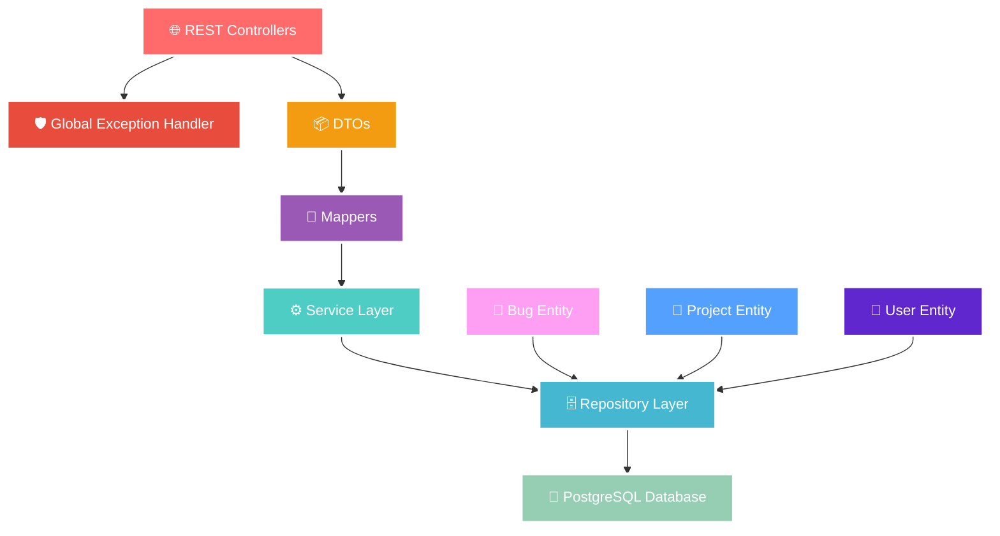

<div align="center">

# 🌟 IssueTrackerORM 🌟


<p align="center">
  
  
  
  
</p>


</div>

<div align="center">


## ✨ **What Makes This Extraordinary?** ✨


</div>

<table align="center">
<tr>
<td width="50%" align="center">


### 🚀 **Lightning Fast Performance**
> *Powered by Spring Boot 3.5.4 for blazing speed*


### 🔒 **Enterprise Security**
> *Bank-grade security with scalable architecture*


### 🎯 **Developer Experience**
> *Intuitive APIs with comprehensive documentation*


### 🛡️ **Smart Error Handling**
> *Global exception management with custom DTOs*

</td>
<td width="50%" align="center">


### 📊 **Real-time Analytics**
> *Live monitoring of bugs, projects, and users*


### 🔄 **Complete CRUD Suite**
> *Full lifecycle management for all entities*


### 🎨 **RESTful Elegance**
> *Beautiful, intuitive API design patterns*


### 📦 **Clean Architecture**
> *DTOs and mappers for secure data flow*

</td>
</tr>
</table>

<div align="center">





</div>

<div align="center">


</div>

<details>
<summary>🐛 <strong>Bug Management System</strong></summary>
<br>

| Feature | Description | Status |
|---------|-------------|--------|
| 📝 **Create Bugs** | Auto-timestamped bug creation | ✅ |
| 🔍 **Smart Filtering** | Filter by status, priority, project, assignee | ✅ |
| 🎯 **Unresolved Tracking** | Find pending bugs by user | ✅ |
| 📊 **Analytics** | Count bugs by project | ✅ |
| 🔄 **Status Updates** | Real-time status management | ✅ |
| 🗑️ **Cleanup** | Safe bug deletion | ✅ |

</details>

<details>
<summary>📁 <strong>Project Management Hub</strong></summary>
<br>

| Feature | Description | Status |
|---------|-------------|--------|
| 🏗️ **Project CRUD** | Complete project lifecycle | ✅ |
| 🔎 **Smart Search** | Find projects by name | ✅ |
| 📈 **Statistics** | Project counting & analytics | ✅ |
| 🔗 **Bug Relations** | Projects with assigned bugs | ✅ |
| ✏️ **Name Updates** | Dynamic project renaming | ✅ |

</details>

<details>
<summary>👥 <strong>User Management Portal</strong></summary>
<br>

| Feature | Description | Status |
|---------|-------------|--------|
| 👤 **User CRUD** | Complete user management | ✅ |
| 🏷️ **Role-based Filtering** | Filter users by roles | ✅ |
| 📊 **Role Analytics** | Count users by role | ✅ |
| 🎯 **Assignment Tracking** | Users with bug assignments | ✅ |
| 🔄 **Profile Updates** | Dynamic user information updates | ✅ |

</details>

<div align="center">


</div>

## 🏛️ **Project Architecture**


<pre>
🏗️ IssueTrackerORM/
┣ 📂 src/
┃ ┣ 📂 main/
┃ ┃ ┣ ☕ java/com/example/IssueTrackerORM/
┃ ┃ ┃ ┣ 🎮 controller/          ← REST API Magic
┃ ┃ ┃ ┃ ┣ 🐛 BugController.java
┃ ┃ ┃ ┃ ┣ 📁 ProjectController.java
┃ ┃ ┃ ┃ ┗ 👤 UserController.java
┃ ┃ ┃ ┣ 🏗️ domain/             ← Entity Models
┃ ┃ ┃ ┃ ┣ 🐛 Bug.java
┃ ┃ ┃ ┃ ┣ 📁 Project.java
┃ ┃ ┃ ┃ ┗ 👤 User.java
┃ ┃ ┃ ┣ 📦 dto/                ← Data Transfer Objects
┃ ┃ ┃ ┃ ┣ 🐛 BugRequestDTO.java
┃ ┃ ┃ ┃ ┗ 🐛 BugResponseDTO.java
┃ ┃ ┃ ┣ 🛡️ exception/          ← Global Exception Handling
┃ ┃ ┃ ┃ ┣ 🌐 GlobalExceptionHandler.java
┃ ┃ ┃ ┃ ┣ 🔍 ResourceNotFoundException.java
┃ ┃ ┃ ┃ ┣ ❌ InvalidInputException.java
┃ ┃ ┃ ┃ ┣ 🔄 DuplicateResourceException.java
┃ ┃ ┃ ┃ ┗ 💾 DatabaseOperationException.java
┃ ┃ ┃ ┣ 🔄 mapper/             ← Entity-DTO Mapping
┃ ┃ ┃ ┃ ┗ 🐛 BugMapper.java
┃ ┃ ┃ ┣ 🗄️ repository/         ← Data Access Layer
┃ ┃ ┃ ┃ ┣ 🐛 BugRepository.java
┃ ┃ ┃ ┃ ┣ 📁 ProjectRepository.java
┃ ┃ ┃ ┃ ┗ 👤 UserRepository.java
┃ ┃ ┃ ┣ ⚙️ service/            ← Business Logic
┃ ┃ ┃ ┃ ┣ 🐛 BugService.java & BugServiceImpl.java
┃ ┃ ┃ ┃ ┣ 📁 ProjectService.java & ProjectServiceImpl.java
┃ ┃ ┃ ┃ ┗ 👤 UserService.java & UserServiceImpl.java
┃ ┃ ┃ ┗ 🚀 IssueTrackerOrmApplication.java
┃ ┃ ┗ 📂 resources/
┃ ┃   ┣ ⚙️ application.properties
┃ ┃   ┣ 🎨 static/
┃ ┃   ┗ 📄 templates/
┃ ┗ 🧪 test/
┗ 📦 pom.xml
</pre>


<div align="center">


</div>

## 🛠️ **API Endpoints**

<div align="center">

### 🐛 **Bug Management APIs**

</div>

| Method | Endpoint | Description | Response |
|--------|----------|-------------|----------|
| 🟢 `GET` | `/api/bugs/` | Fetch all bugs | `200 OK` |
| 🟢 `GET` | `/api/bugs/{id}` | Get specific bug | `200 OK` |
| 🟡 `POST` | `/api/bugs/create` | Create new bug | `201 Created` |
| 🟢 `GET` | `/api/bugs/status/{status}` | Filter by status | `200 OK` |
| 🟢 `GET` | `/api/bugs/priority/{priority}` | Filter by priority | `200 OK` |
| 🟢 `GET` | `/api/bugs/project/{projectId}` | Bugs by project | `200 OK` |
| 🟢 `GET` | `/api/bugs/assignedTo/{userId}` | Bugs by assignee | `200 OK` |
| 🟢 `GET` | `/api/bugs/unresolved/{userId}` | Unresolved bugs | `200 OK` |
| 🟢 `GET` | `/api/bugs/count/{projectId}` | Count project bugs | `200 OK` |
| 🔵 `PUT` | `/api/bugs/{id}/{status}` | Update bug status | `200 OK` |
| 🔴 `DELETE` | `/api/bugs/{id}` | Delete bug | `200 OK` |

<div align="center">

### 📁 **Project Management APIs**

</div>

| Method | Endpoint | Description | Response |
|--------|----------|-------------|----------|
| 🟢 `GET` | `/api/projects/` | All projects | `200 OK` |
| 🟢 `GET` | `/api/projects/id/{projectId}` | Project by ID | `200 OK` |
| 🟢 `GET` | `/api/projects/name/{name}` | Project by name | `200 OK` |
| 🟡 `POST` | `/api/projects/create` | Create project | `201 Created` |
| 🟢 `GET` | `/api/projects/count` | Count all projects | `200 OK` |
| 🟢 `GET` | `/api/projects/with-bugs` | Projects with bugs | `200 OK` |
| 🔵 `PUT` | `/api/projects/{oldName}/{newName}` | Update project name | `200 OK` |
| 🔴 `DELETE` | `/api/projects/{id}` | Delete project | `200 OK` |

<div align="center">

### 👥 **User Management APIs**

</div>

| Method | Endpoint | Description | Response |
|--------|----------|-------------|----------|
| 🟢 `GET` | `/api/users/` | All users | `200 OK` |
| 🟢 `GET` | `/api/users/{id}` | User by ID | `200 OK` |
| 🟢 `GET` | `/api/users/name/{name}` | User by name | `200 OK` |
| 🟢 `GET` | `/api/users/role/{role}` | Users by role | `200 OK` |
| 🟡 `POST` | `/api/users/create` | Create user | `201 Created` |
| 🟢 `GET` | `/api/users/count/role/{role}` | Count by role | `200 OK` |
| 🟢 `GET` | `/api/users/with-bugs` | Users with bugs | `200 OK` |
| 🔵 `PUT` | `/api/users/{id}` | Update user | `200 OK` |
| 🔴 `DELETE` | `/api/users/{id}` | Delete user | `200 OK` |

<div align="center">


</div>

## ⚙️ **Configuration**

<div align="center">

### 🐘 **Database Setup**

</div>

```properties
# 🚀 Application Configuration
spring.application.name=IssueTrackerORM
server.port=8080

# 🐘 PostgreSQL Database
spring.datasource.url=jdbc:postgresql://localhost:5432/issuetracker
spring.datasource.username=XXX
spring.datasource.password=YYY

# 🔧 JPA Configuration
spring.jpa.hibernate.ddl-auto=update
spring.jpa.show-sql=true
spring.jpa.open-in-view=false

# 🎨 UI Configuration
spring.main.banner-mode=off

# 📊 Logging
logging.level.root=WARN
logging.level.com.example.practice=WARN
```

<div align="center">


</div>

## 🚀 **Technology Stack**

<div align="center">

<table>
<tr>
<td align="center" width="20%">

<br><strong>Spring Boot</strong>
<br><sub>3.5.4</sub>
</td>
<td align="center" width="20%">

<br><strong>Java</strong>
<br><sub>21</sub>
</td>
<td align="center" width="20%">

<br><strong>PostgreSQL</strong>
<br><sub>Latest</sub>
</td>
<td align="center" width="20%">

<br><strong>Maven</strong>
<br><sub>Latest</sub>
</td>
<td align="center" width="20%">

<br><strong>Spring Data JPA</strong>
<br><sub>Latest</sub>
</td>
</tr>
</table>

<div align="center">

### 🔧 **Enhanced Dependencies**

<p>
  
  
  
</p>


</div>

</div>

<div align="center">


</div>

## 🚀 **Quick Start Guide**

<div align="center">

### 🎯 **Get Up and Running in 5 Minutes!**

</div>

```bash
# 1️⃣ Clone the repository
git clone https://github.com/soundar-19/SpringBootTraining.git
cd IssueTrackerORM

# 2️⃣ Start PostgreSQL
# Ensure PostgreSQL is running on localhost:5432

# 3️⃣ Create database
psql -U postgres -c "CREATE DATABASE issuetracker;"

# 4️⃣ Configure credentials (if needed)
# Edit src/main/resources/application.properties

# 5️⃣ Run the application
./mvnw spring-boot:run

# 🎉 That's it! Your app is running on http://localhost:8080
```

<div align="center">

### 🔗 **Quick Access Links**

[](http://localhost:8080/api/)
[](http://localhost:8080/actuator/health)

</div>

<div align="center">


</div>

## 🎯 **Usage Examples**

<details>
<summary>🐛 <strong>Creating a Bug</strong></summary>

```bash
curl -X POST http://localhost:8080/api/bugs/create \
  -H "Content-Type: application/json" \
  -d '{
    "title": "Login button not working",
    "description": "Users cannot login using the main login button",
    "status": "Open",
    "priority": "High",
    "project": {"id": 1}
  }'
```

</details>

<details>
<summary>📁 <strong>Creating a Project</strong></summary>

```bash
curl -X POST http://localhost:8080/api/projects/create \
  -H "Content-Type: application/json" \
  -d '{
    "name": "E-Commerce Platform"
  }'
```

</details>

<details>
<summary>👤 <strong>Creating a User</strong></summary>

```bash
curl -X POST http://localhost:8080/api/users/create \
  -H "Content-Type: application/json" \
  -d '{
    "name": "John Doe",
    "role": "Developer"
  }'
```

</details>

<div align="center">


### 💎 **Built with Passion, Powered by Innovation** 💎


### 🤝 **Join Our Community**

<p>
  
  
  
</p>


</div>
