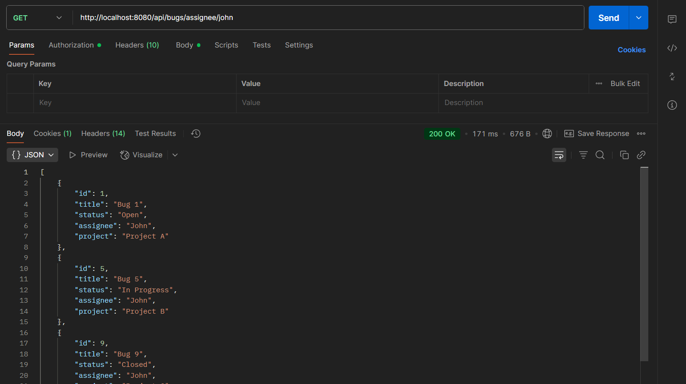

# Bug Tracker with Basic Authentication

A Spring Boot REST API application for managing bugs with basic authentication security.

## Features

- **Bug Management**: Create, read, update, and delete bug reports
- **Filtering**: Filter bugs by status, assignee, or project
- **Basic Authentication**: Secure API endpoints with username/password
- **In-Memory Database**: H2 database for development and testing
- **RESTful API**: Clean REST endpoints for all operations

## Technology Stack

- **Java 21**
- **Spring Boot 3.5.4**
- **Spring Security** (Basic Authentication)
- **Spring Data JPA**
- **H2 Database** (In-memory)
- **Maven** (Build tool)
- **Lombok** (Code generation)

## Prerequisites

- Java 21 or higher
- Maven 3.6+ (or use included Maven wrapper)

## Quick Start

### 1. Clone and Build

```bash
git clone <repository-url>
cd bug_tracker_security_basic_auth
./mvnw clean install
```

### 2. Run the Application

```bash
./mvnw spring-boot:run
```

The application will start on `http://localhost:8080`

### 3. Authentication

All API endpoints require basic authentication:
- **Username**: `admin`
- **Password**: `password`

## API Endpoints

### Base URL: `/api/bugs`

| Method | Endpoint | Description | Parameters |
|--------|----------|-------------|------------|
| GET | `/api/bugs` | Get all bugs with optional filters | `status`, `assignee`, `project` (query params) |
| GET | `/api/bugs/id/{id}` | Get bug by ID | `id` (path variable) |
| GET | `/api/bugs/status/{status}` | Get bugs by status | `status` (path variable) |
| GET | `/api/bugs/assignee/{assignee}` | Get bugs by assignee | `assignee` (path variable) |
| GET | `/api/bugs/project/{project}` | Get bugs by project | `project` (path variable) |

### Example Requests

#### Get all bugs
```bash
curl -u admin:password http://localhost:8080/api/bugs
```

#### Filter bugs by status
```bash
curl -u admin:password "http://localhost:8080/api/bugs?status=Open"
```

#### Get bugs by assignee
```bash
curl -u admin:password http://localhost:8080/api/bugs/assignee/John
```

#### Get bugs by project
```bash
curl -u admin:password http://localhost:8080/api/bugs/project/Project%20A
```

### API Screenshots





## Sample Data

The application loads sample data on startup:

- 10 sample bugs with different statuses (Open, In Progress, Closed)
- Assigned to various team members (John, Jane, Bob, Alice)
- Distributed across projects (Project A, Project B, Project C)

## Database Access

### H2 Console (Development)

Access the H2 database console at: `http://localhost:8080/h2-console`

**Connection Details:**
- JDBC URL: `jdbc:h2:mem:bugtracker`
- Username: `sa`
- Password: (leave empty)

## Configuration

### Application Properties

Key configuration options in `application.properties`:

```properties
# Server
server.port=8080

# Database
spring.datasource.url=jdbc:h2:mem:bugtracker
spring.datasource.username=sa
spring.datasource.password=

# Security
spring.security.user.name=admin
spring.security.user.password=password

# H2 Console
spring.h2.console.enabled=true
```

### Customization

To customize the application:

1. **Change Authentication**: Modify security properties in `application.properties`
2. **Database**: Replace H2 with PostgreSQL/MySQL by updating dependencies and datasource configuration
3. **Port**: Change `server.port` property
4. **Sample Data**: Modify the `CommandLineRunner` bean in the main application class

## Project Structure

```
src/
├── main/
│   ├── java/com/ex/bug_tracker_security_basic_auth/
│   │   ├── controller/          # REST controllers
│   │   ├── service/             # Business logic
│   │   ├── repository/          # Data access layer
│   │   ├── entity/              # JPA entities
│   │   ├── dto/                 # Data transfer objects
│   │   └── BugTrackerSecurityBasicAuthApplication.java
│   └── resources/
│       └── application.properties
└── test/
    └── java/                    # Test classes
```

## Development

### Running in Development Mode

```bash
./mvnw spring-boot:run -Dspring-boot.run.profiles=dev
```

### Building for Production

```bash
./mvnw clean package
java -jar target/bug_tracker_security_basic_auth-0.0.1-SNAPSHOT.jar
```

## Testing

Run tests with:

```bash
./mvnw test
```

## Troubleshooting

### Common Issues

1. **Port Already in Use**: Change `server.port` in `application.properties`
2. **Authentication Failed**: Verify username/password (`admin`/`password`)
3. **Database Connection**: Check H2 console configuration

### Logs

Enable debug logging by adding to `application.properties`:

```properties
logging.level.com.ex.bug_tracker_security_basic_auth=DEBUG
logging.level.org.springframework.security=DEBUG
```

## Contributing

1. Fork the repository
2. Create a feature branch
3. Make your changes
4. Add tests
5. Submit a pull request

## License

This project is for educational purposes as part of Spring Boot training.
