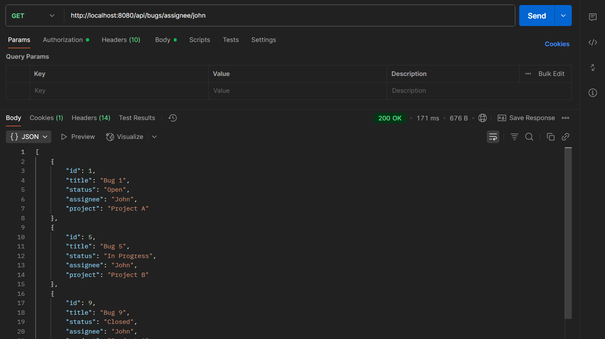
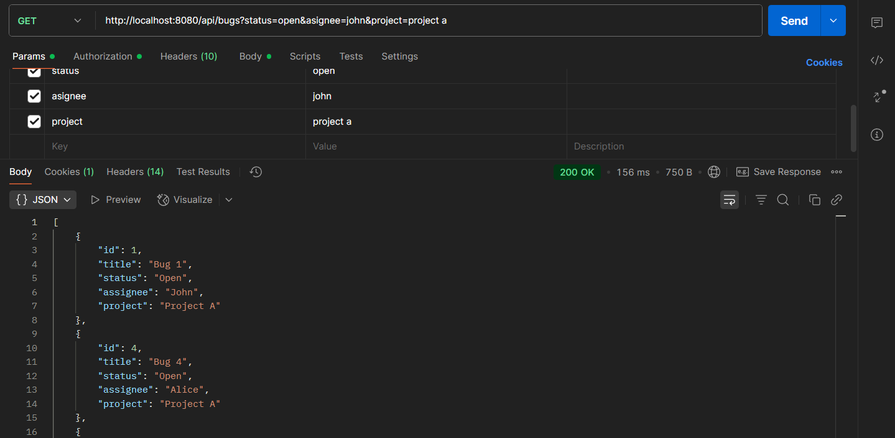
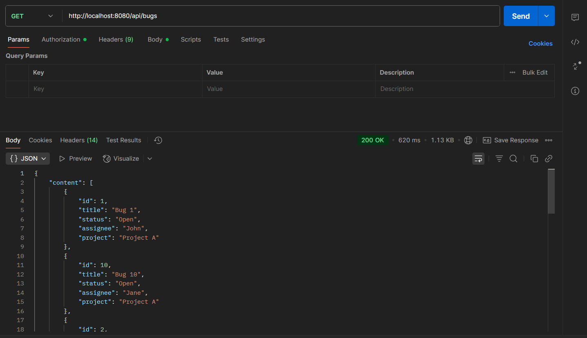
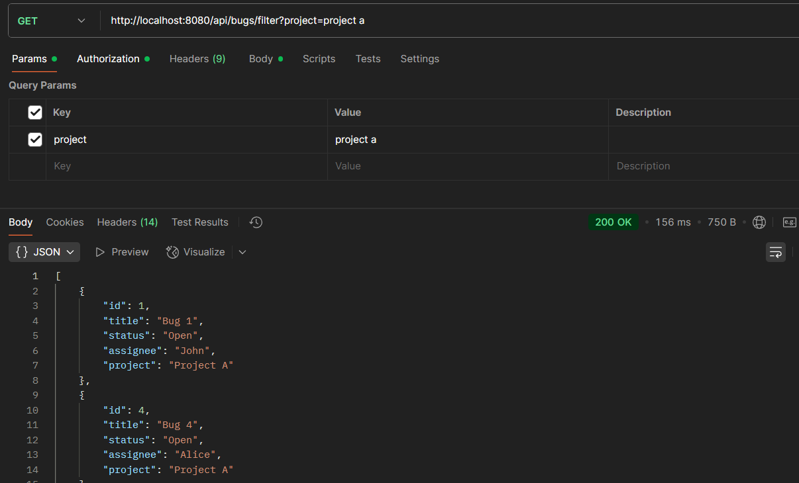
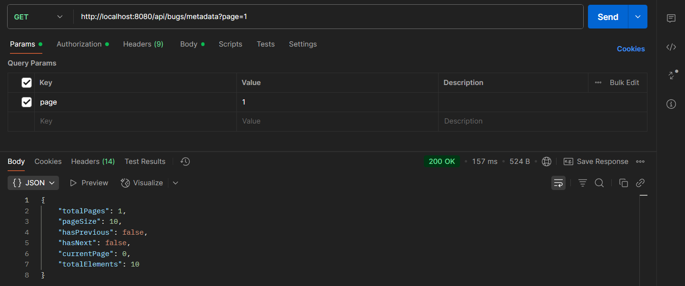
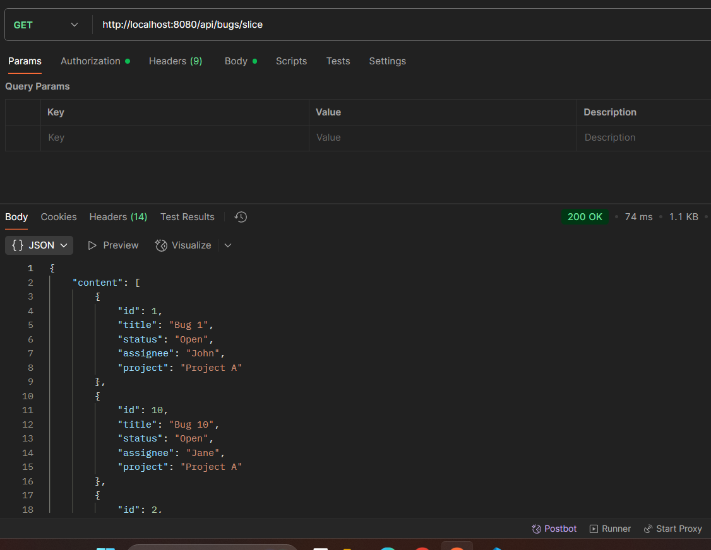
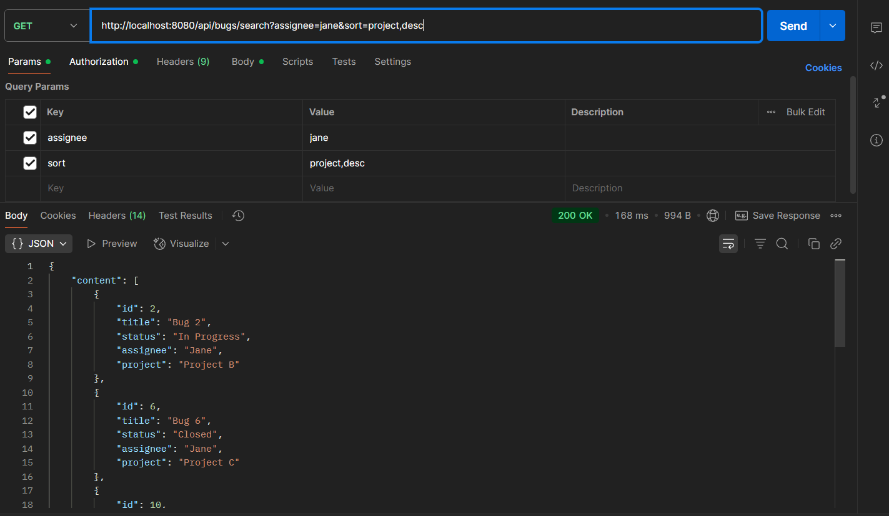

# Bug Tracker with JWT Authentication & Role-Based Access Control

A Spring Boot REST API application for managing bugs with JWT authentication, role-based security, and advanced pagination/sorting features.

## Features

- **Bug Management**: Create, read, update, and delete bug reports
- **Filtering**: Filter bugs by status, assignee, or project
- **Advanced Pagination**: Multiple sort fields, search with paging, metadata-only responses
- **JWT Authentication**: Secure API endpoints with JSON Web Tokens
- **Role-Based Access Control**: Three user roles with different permissions
- **In-Memory Database**: H2 database for development and testing
- **RESTful API**: Clean REST endpoints for all operations

## Technology Stack

- **Java 21**
- **Spring Boot 3.5.4**
- **Spring Security** (Basic Authentication)
- **Spring Data JPA**
- **H2 Database** (In-memory)
- **Maven** (Build tool)
- **Lombok** (Code generation)

## Prerequisites

- Java 21 or higher
- Maven 3.6+ (or use included Maven wrapper)

## Quick Start

### 1. Clone and Build

```bash
git clone <repository-url>
cd bug_tracker_security_basic_auth
./mvnw clean install
```

### 2. Run the Application

```bash
./mvnw spring-boot:run
```

The application will start on `http://localhost:8080`

### 3. Authentication

#### JWT Login
First, obtain a JWT token by logging in:

```bash
curl -X POST http://localhost:8080/api/auth/login \
  -H "Content-Type: application/json" \
  -d '{"userName":"admin","password":"admin123"}'
```

#### User Roles & Permissions

**Admin User (Full Access):**
- **Username**: `admin`
- **Password**: `admin123`
- **Access**: Create, Read, Update, Delete all bugs

**Developer User (Read + Update Status):**
- **Username**: `dev`
- **Password**: `dev123`
- **Access**: All GET endpoints + Update bug status only

**Regular User (Read-Only):**
- **Username**: `SR`
- **Password**: `143`
- **Access**: All GET endpoints only

## API Endpoints

### Base URL: `/api/bugs`

| Method | Endpoint | Description | Access | Parameters |
|--------|----------|-------------|-----------|-----------|
| POST | `/api/auth/login` | Login and get JWT token | Public | `userName`, `password` in request body |
| GET | `/api/bugs` | Get all bugs with pagination | Admin, Developer, User | `page`, `size`, `sort` (query params) |
| GET | `/api/bugs/search` | Search with filters and pagination | Admin, Developer, User | `status`, `assignee`, `project`, `page`, `size`, `sort` |
| GET | `/api/bugs/slice` | Pagination without total count | Admin, Developer, User | `page`, `size`, `sort` |
| GET | `/api/bugs/metadata` | Only pagination metadata | Admin, Developer, User | `status`, `assignee`, `project`, `page`, `size` |
| GET | `/api/bugs/filter` | Filter bugs (no pagination) | Admin, Developer, User | `status`, `assignee`, `project` |
| GET | `/api/bugs/id/{id}` | Get bug by ID | Admin, Developer, User | `id` (path variable) |
| GET | `/api/bugs/status/{status}` | Get bugs by status | Admin, Developer, User | `status` (path variable) |
| GET | `/api/bugs/assignee/{assignee}` | Get bugs by assignee | Admin, Developer, User | `assignee` (path variable) |
| GET | `/api/bugs/project/{project}` | Get bugs by project | Admin, Developer, User | `project` (path variable) |
| POST | `/api/bugs/admin` | Create new bug | **Admin Only** | Bug object in request body |
| PUT | `/api/bugs/admin/{id}` | Update bug | **Admin Only** | `id` (path variable), Bug object in request body |
| DELETE | `/api/bugs/admin/{id}` | Delete bug | **Admin Only** | `id` (path variable) |
| PUT | `/api/bugs/developer/{id}/status` | Update bug status | **Developer Only** | `id` (path variable), `status` (query param) |

## Pagination Features

### Multiple Sort Fields
```bash
GET /api/bugs?page=1&size=5&sort=status,asc&sort=title,desc
```

### Search with Paging
```bash
GET /api/bugs/search?status=Open&page=1&size=3
```

### Metadata Only
```bash
GET /api/bugs/metadata?status=Open&page=1&size=10
```

### Example Requests

#### Login and get JWT token
```bash
curl -X POST http://localhost:8080/api/auth/login \
  -H "Content-Type: application/json" \
  -d '{"userName":"admin","password":"admin123"}'
```

#### Get all bugs with JWT token
```bash
curl -H "Authorization: Bearer YOUR_JWT_TOKEN" \
  "http://localhost:8080/api/bugs?page=1&size=5"
```

#### Create new bug (Admin only)
```bash
curl -H "Authorization: Bearer YOUR_JWT_TOKEN" \
  -X POST "http://localhost:8080/api/bugs/admin" \
  -H "Content-Type: application/json" \
  -d '{"title":"New Bug","description":"Bug description","status":"Open","assignee":"John","project":"Project A"}'
```

#### Update bug (Admin only)
```bash
curl -H "Authorization: Bearer YOUR_JWT_TOKEN" \
  -X PUT "http://localhost:8080/api/bugs/admin/1" \
  -H "Content-Type: application/json" \
  -d '{"title":"Updated Bug","description":"Updated description","status":"In Progress","assignee":"Jane","project":"Project B"}'
```

#### Update bug status (Developer only)
```bash
curl -H "Authorization: Bearer YOUR_JWT_TOKEN" \
  -X PUT "http://localhost:8080/api/bugs/developer/1/status?status=Closed"
```

#### Delete bug (Admin only)
```bash
curl -H "Authorization: Bearer YOUR_JWT_TOKEN" \
  -X DELETE "http://localhost:8080/api/bugs/admin/1"
```

## Configuration

- Pages start at 1 (human-friendly)
- Default page size: 10
- Default sort: title
- JWT token expiration: 2.5 minutes
- H2 database with console at `/h2-console`

### Application Properties

Key pagination configuration in `application.properties`:

```properties
# Pagination Configuration
spring.data.web.pageable.default-page-size=10
spring.data.web.pageable.page-parameter=page
spring.data.web.pageable.size-parameter=size
spring.data.web.pageable.one-indexed-parameters=true

# Security (In-Memory Users)
# Admin: admin/admin123 (Full Access)
# Developer: dev/dev123 (Read + Update Status)
# User: SR/143 (Read-Only Access)

# JWT Configuration
# Token expiration: 2.5 minutes (150000 ms)
# Secret key: Base64 encoded

# Database
spring.datasource.url=jdbc:h2:mem:bugtracker
spring.h2.console.enabled=true
```

## Example Responses

### Paginated Response
```json
{
  "content": [...],
  "totalElements": 50,
  "totalPages": 5,
  "number": 0,
  "size": 10,
  "hasNext": true,
  "hasPrevious": false
}
```

### Metadata Response
```json
{
  "totalElements": 50,
  "totalPages": 5,
  "currentPage": 0,
  "pageSize": 10,
  "hasNext": true,
  "hasPrevious": false
}
```

## Sample Data

The application loads sample data on startup:

- 10 sample bugs with different statuses (Open, In Progress, Closed)
- Assigned to various team members (John, Jane, Bob, Alice)
- Distributed across projects (Project A, Project B, Project C)

## Database Access

### H2 Console (Development)

Access the H2 database console at: `http://localhost:8080/h2-console`

**Connection Details:**
- JDBC URL: `jdbc:h2:mem:bugtracker`
- Username: `sa`
- Password: (leave empty)

## Project Structure

```
src/
├── main/
│   ├── java/com/ex/bug_tracker_security_basic_auth/
│   │   ├── controller/          # REST controllers
│   │   ├── service/             # Business logic
│   │   ├── repository/          # Data access layer
│   │   ├── entity/              # JPA entities
│   │   ├── dto/                 # Data transfer objects
│   │   └── BugTrackerSecurityBasicAuthApplication.java
│   └── resources/
│       └── application.properties
└── test/
    └── java/                    # Test classes
```

## Development

### Running in Development Mode

```bash
./mvnw spring-boot:run -Dspring-boot.run.profiles=dev
```

### Building for Production

```bash
./mvnw clean package
java -jar target/bug_tracker_security_basic_auth-0.0.1-SNAPSHOT.jar
```

## Testing

Run tests with:

```bash
./mvnw test
```

## API Screenshots












## Troubleshooting

### Common Issues

1. **Port Already in Use**: Change `server.port` in `application.properties`
2. **Authentication Failed**: Verify username/password and ensure JWT token is valid
3. **Token Expired**: JWT tokens expire after 2.5 minutes, login again to get new token
4. **Access Denied**: Check if user role has permission for the endpoint
5. **Database Connection**: Check H2 console configuration

### Logs

Enable debug logging by adding to `application.properties`:

```properties
logging.level.com.ex.bug_tracker_security_basic_auth=DEBUG
logging.level.org.springframework.security=DEBUG
```

## Contributing

1. Fork the repository
2. Create a feature branch
3. Make your changes
4. Add tests
5. Submit a pull request

## License

This project is for educational purposes as part of Spring Boot training.