<div align="center">

# 🎓 Student Course Management System


[](https://spring.io/projects/spring-boot)
[](https://openjdk.org/)
[](https://www.postgresql.org/)
[](https://maven.apache.org/)
[](http://localhost:8080/swagger-ui.html)


</div>

---

## 🌟 **What Makes This Special?**

<table>
<tr>
<td width="50%">

### 🚀 **Lightning Fast**
> Built with Spring Boot 3.5.4 for maximum performance

### 🔒 **Enterprise Ready**
> Production-grade validation and error handling

### 🎯 **Developer Friendly**
> Clean architecture with comprehensive APIs

### 🛡️ **Advanced Validation**
> Jakarta Bean Validation with custom business rules

</td>
<td width="50%">

### 📊 **Real-time Management**
> Monitor students, courses, and enrollments seamlessly

### 🔄 **Full CRUD Operations**
> Complete lifecycle management for all entities

### 🎨 **RESTful Design**
> Beautiful, intuitive API endpoints

### 📦 **Structured Responses**
> Enhanced DTOs with detailed error handling

### 📚 **Interactive API Documentation**
> Swagger UI with OpenAPI 3.0 specification

</td>
</tr>
</table>

---

## 🏗️ **Architecture Overview**

```mermaid
graph TB
    A[🌐 REST Controllers] --> H[🛡️ Global Exception Handler]
    A --> I[📦 DTOs]
    I --> J[🔄 Mappers]
    J --> B[⚙️ Service Layer]
    B --> C[🗄️ Repository Layer]
    C --> D[🐘 PostgreSQL Database]
    
    E[🎓 Student Entity] --> C
    F[📚 Course Entity] --> C
    G[📋 Enrollment Entity] --> C
    K[🔗 One-to-Many Relations] --> C
    
    style A fill:#ff6b6b,stroke:#333,stroke-width:2px,color:#fff
    style H fill:#e74c3c,stroke:#333,stroke-width:2px,color:#fff
    style I fill:#f39c12,stroke:#333,stroke-width:2px,color:#fff
    style J fill:#9b59b6,stroke:#333,stroke-width:2px,color:#fff
    style B fill:#4ecdc4,stroke:#333,stroke-width:2px,color:#fff
    style C fill:#45b7d1,stroke:#333,stroke-width:2px,color:#fff
    style D fill:#96ceb4,stroke:#333,stroke-width:2px,color:#fff
```

<div align="center">



</div>

---

## ✨ **Core Features**

<details>
<summary>🎓 <strong>Student Management System</strong></summary>
<br>

| Feature | Description | Status |
|---------|-------------|--------|
| 📝 **Create Students** | Enhanced validation with pattern matching | ✅ |
| 🔍 **Smart Search** | Find by ID, roll number with validation | ✅ |
| 📊 **Profile Management** | Complete CRUD with input sanitization | ✅ |
| 🔗 **Enrollment Tracking** | Many-to-many course relationships | ✅ |
| 📦 **DTO Support** | Request/Response DTOs with validation | ✅ |
| 🛡️ **Input Validation** | Jakarta Bean + custom business rules | ✅ |
| 🔄 **Path Validation** | URL parameter validation | ✅ |

</details>

<details>
<summary>📚 <strong>Course Management Hub</strong></summary>
<br>

| Feature | Description | Status |
|---------|-------------|--------|
| 🏗️ **Course CRUD** | Complete course lifecycle management | ✅ |
| 🔎 **Advanced Search** | Find by code, title, credits | ✅ |
| 📈 **Credit Validation** | 1-6 credits with business rules | ✅ |
| 🔗 **Student Relations** | Courses with enrolled students | ✅ |
| 📦 **Enhanced DTOs** | Pattern validation for course codes | ✅ |
| 🛡️ **Format Validation** | Course code pattern matching | ✅ |

</details>

<details>
<summary>📋 <strong>Enrollment Management System</strong></summary>
<br>

| Feature | Description | Status |
|---------|-------------|--------|
| 📝 **Enroll Students** | Rich enrollment entity with metadata | ✅ |
| 🚫 **Duplicate Prevention** | No duplicate enrollments allowed | ✅ |
| 🔄 **Unenroll Students** | Safe unenrollment with validation | ✅ |
| 📊 **Enrollment Tracking** | Date, status, grade, semester tracking | ✅ |
| 🎯 **Grade Management** | Update and track student grades | ✅ |
| 📈 **Status Management** | ACTIVE, COMPLETED, DROPPED, WITHDRAWN | ✅ |
| 🔍 **Advanced Queries** | Student/Course enrollment lookups | ✅ |
| 🛡️ **Transaction Safety** | @Transactional for data consistency | ✅ |

</details>

---

## 🔥 **Enhanced Validation & Exception Handling**

<div align="center">

### 🛡️ **Comprehensive Error Management**

</div>

| Exception Type | HTTP Status | Description |
|---------------|-------------|-------------|
| 🔍 `ResourceNotFoundException` | `404 NOT FOUND` | Resource not found |
| ❌ `MethodArgumentNotValidException` | `400 BAD REQUEST` | Bean validation errors |
| 🔄 `ConstraintViolationException` | `400 BAD REQUEST` | Path variable validation |
| 💾 `MethodArgumentTypeMismatchException` | `400 BAD REQUEST` | Type conversion errors |
| 🛡️ `DuplicateResourceException` | `409 CONFLICT` | Duplicate resource |
| 🔄 `ValidationException` | `400 BAD REQUEST` | Custom business validation |
| 🌐 `Exception` | `500 INTERNAL ERROR` | Generic error handling |

**Key Features:**
- ✨ Structured error responses with timestamps
- 📝 Detailed validation error collection
- 🔍 Field-level error messages
- 🛡️ Path variable validation
- 🔄 Input sanitization in DTOs

---

## 📚 **API Documentation**

<div align="center">

### 🚀 **Interactive Swagger UI**

**Access the complete API documentation at:**

🔗 **[http://localhost:8080/swagger-ui.html](http://localhost:8080/swagger-ui.html)**

*Try out all endpoints directly from your browser!*

</div>

---

## 🛠️ **API Endpoints**

<div align="center">

### 🎓 **Student Management APIs**

</div>

| Method | Endpoint | Description | Response |
|--------|----------|-------------|----------|
| 🟢 `GET` | `/api/students/` | Fetch all students | `200 OK` |
| 🟢 `GET` | `/api/students/{id}` | Get student by ID | `200 OK` |
| 🟢 `GET` | `/api/students/rollNumber/{rollNumber}` | Get by roll number | `200 OK` |
| 🟡 `POST` | `/api/students` | Create new student | `201 Created` |
| 🔵 `PUT` | `/api/students/{id}` | Update student | `200 OK` |
| 🔴 `DELETE` | `/api/students/{id}` | Delete student | `200 OK` |

<div align="center">

### 📚 **Course Management APIs**

</div>

| Method | Endpoint | Description | Response |
|--------|----------|-------------|----------|
| 🟢 `GET` | `/api/courses/` | All courses | `200 OK` |
| 🟢 `GET` | `/api/courses/{id}` | Course by ID | `200 OK` |
| 🟢 `GET` | `/api/courses/code/{courseCode}` | Course by code | `200 OK` |
| 🟢 `GET` | `/api/courses/title/{courseTitle}` | Course by title | `200 OK` |
| 🟢 `GET` | `/api/courses/credits/{credits}` | Courses by credits | `200 OK` |
| 🟡 `POST` | `/api/courses` | Create course | `201 Created` |
| 🔵 `PUT` | `/api/courses/{id}` | Update course | `200 OK` |
| 🔴 `DELETE` | `/api/courses/{id}` | Delete course | `200 OK` |

<div align="center">

### 📋 **Enrollment Management APIs**

</div>

| Method | Endpoint | Description | Response |
|--------|----------|-------------|----------|
| 🟡 `POST` | `/api/enrollments` | Enroll student in course | `201 Created` |
| 🔴 `DELETE` | `/api/enrollments/student/{studentId}/course/{courseId}` | Unenroll student | `200 OK` |
| 🟢 `GET` | `/api/enrollments/student/{studentId}` | Get student enrollments | `200 OK` |
| 🟢 `GET` | `/api/enrollments/course/{courseId}` | Get course enrollments | `200 OK` |
| 🟢 `GET` | `/api/enrollments` | Get all enrollments | `200 OK` |
| 🔵 `PUT` | `/api/enrollments/{enrollmentId}/grade` | Update enrollment grade | `200 OK` |

---

## 🚀 **Quick Start Guide**

<div align="center">

### 🎯 **Get Up and Running in 5 Minutes!**

</div>

```bash
# 1️⃣ Clone the repository
git clone <repository-url>
cd student_course_management_system

# 2️⃣ Start PostgreSQL
# Ensure PostgreSQL is running on localhost:5432

# 3️⃣ Create database
psql -U postgres -c "CREATE DATABASE student_course_db;"

# 4️⃣ Configure credentials (if needed)
# Edit src/main/resources/application.properties

# 5️⃣ Run the application
./mvnw spring-boot:run

# 🎉 That's it! Your app is running on http://localhost:8080

# 📚 Access Swagger UI at http://localhost:8080/swagger-ui.html
```

---

## 🎯 **Usage Examples**

<details>
<summary>🎓 <strong>Creating a Student</strong></summary>

```bash
curl -X POST http://localhost:8080/api/students \
  -H "Content-Type: application/json" \
  -d '{
    "name": "John Doe",
    "rollNumber": 12345,
    "email": "john.doe@example.com"
  }'
```

</details>

<details>
<summary>📚 <strong>Creating a Course</strong></summary>

```bash
curl -X POST http://localhost:8080/api/courses \
  -H "Content-Type: application/json" \
  -d '{
    "courseCode": "CS101",
    "courseTitle": "Introduction to Data Structures",
    "credits": 3
  }'
```

</details>

<details>
<summary>📋 <strong>Enrolling Student in Course</strong></summary>

```bash
curl -X POST http://localhost:8080/api/enrollments \
  -H "Content-Type: application/json" \
  -d '{
    "studentId": 1,
    "courseId": 1,
    "semester": "Fall",
    "year": 2024
  }'
```

</details>

<details>
<summary>🎯 <strong>Updating Student Grade</strong></summary>

```bash
# Update grade for enrollment ID 1
curl -X PUT "http://localhost:8080/api/enrollments/1/grade?grade=A"
```

</details>

<details>
<summary>📊 <strong>Getting Student Enrollments</strong></summary>

```bash
# Get all enrollments for student ID 1
curl -X GET http://localhost:8080/api/enrollments/student/1
```

</details>

---

<div align="center">

## 🌟 **Why Choose Student Course Management System?**

### 💡 **Built with Excellence, Powered by Innovation**

*"Education is the most powerful weapon which you can use to change the world"* - Nelson Mandela

**🎓 Now with Enhanced Enrollment Management!**

---

## 📋 **Enrollment Entity Features**

### 🎯 **Rich Domain Model**
- **Enrollment ID**: Unique identifier for each enrollment
- **Student & Course References**: Foreign key relationships
- **Enrollment Date**: Automatic timestamp when enrolled
- **Status Tracking**: ACTIVE, COMPLETED, DROPPED, WITHDRAWN
- **Grade Management**: Store and update student grades
- **Semester & Year**: Academic period tracking

### 🔄 **Business Logic**
- **Duplicate Prevention**: No duplicate enrollments allowed
- **Automatic Timestamps**: Enrollment date set automatically
- **Status Management**: Track enrollment lifecycle
- **Grade Updates**: Modify grades after enrollment
- **Cascade Operations**: Proper cleanup on deletions

### 🗄️ **Database Schema**
```sql
CREATE TABLE enrollments (
    id BIGSERIAL PRIMARY KEY,
    student_id BIGINT NOT NULL REFERENCES students(id),
    course_id BIGINT NOT NULL REFERENCES courses(id),
    enrollment_date TIMESTAMP NOT NULL,
    status VARCHAR(20) DEFAULT 'ACTIVE',
    grade VARCHAR(5),
    semester VARCHAR(20),
    year INTEGER,
    UNIQUE(student_id, course_id)
);
```

---

## 📚 **Swagger UI Features**

<div align="center">

### 🎯 **What You Get with Swagger UI**

</div>

| Feature | Description | Benefit |
|---------|-------------|----------|
| 🔍 **Interactive Testing** | Test all endpoints directly | No need for external tools |
| 📖 **Auto-Generated Docs** | Always up-to-date documentation | Synchronized with code |
| 🎨 **Beautiful Interface** | Clean, professional UI | Easy to navigate and use |
| 📝 **Request/Response Examples** | See exact data formats | Understand API contracts |
| 🔐 **Validation Details** | View all validation rules | Know exactly what's required |
| 📊 **Schema Definitions** | Complete data models | Understand entity relationships |

### 🌐 **Access Points**

- **Swagger UI**: `http://localhost:8080/swagger-ui.html`
- **Alternative UI**: `http://localhost:8080/swagger-ui/index.html`
- **OpenAPI JSON**: `http://localhost:8080/v3/api-docs`
- **OpenAPI YAML**: `http://localhost:8080/v3/api-docs.yaml`

---

### 🤝 **Contributing**

Please feel free to submit a Pull Request.

</div>