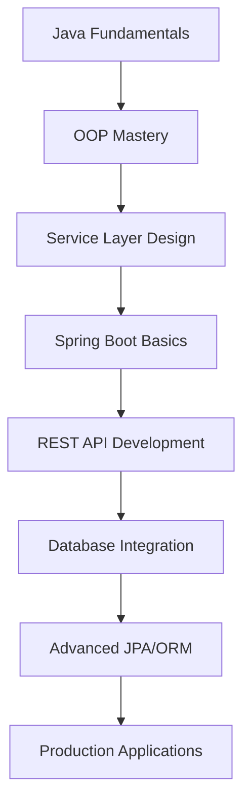

<div align="center">

# 🚀 Enterprise Spring Boot Training Hub

### *A Comprehensive Journey from Java Fundamentals to Production-Ready Applications*

[](https://openjdk.java.net/projects/jdk/21/)
[](https://spring.io/projects/spring-boot)
[](https://www.postgresql.org/)
[](https://maven.apache.org/)
[](#)

*Transforming theoretical knowledge into practical expertise through 25+ hands-on projects*

</div>

---

## 🎯 **Mission Statement**

This repository represents a **complete enterprise-grade training curriculum** designed to transform developers from Java fundamentals to Spring Boot mastery. Each project builds upon previous concepts, creating a seamless learning progression that mirrors real-world software development practices.

## 🏗️ **Architecture Overview**



## 📊 **Training Statistics**

| Metric | Count | Description |
|--------|-------|-------------|
| **Total Projects** | 25+ | From basic Java to enterprise Spring Boot |
| **Lines of Code** | 15,000+ | Production-quality implementations |
| **Technologies** | 12+ | Java, Spring Boot, JPA, PostgreSQL, Maven |
| **Learning Hours** | 200+ | Comprehensive hands-on experience |
| **API Endpoints** | 50+ | RESTful services with full CRUD operations |

---

## 🗂️ **Complete Project Catalog**

### 📚 **Phase I: Java Fundamentals & OOP Mastery**

<details>
<summary><strong>🔹 Core Java Projects (Days 1-7)</strong></summary>

| Project | Focus Area | Key Concepts | Status |
|---------|------------|--------------|--------|
| `day1proj1phase1` | Basic OOP | Classes, Objects, Encapsulation | ✅ Complete |
| `day1proj1phase2` | Service Layer | Separation of Concerns, Modularity | ✅ Complete |
| `day2proj2phase1` | Advanced OOP | Composition, Aggregation | ✅ Complete |
| `day3proj1phase1` | Inheritance | Polymorphism, Abstract Classes | ✅ Complete |
| `day3proj1phase2` | Interface Design | Contract Programming | ✅ Complete |
| `day3project2` | Complex Systems | Multi-tier Architecture | ✅ Complete |
| `day4proj1phase1` | Collections Framework | Data Structures, Algorithms | ✅ Complete |
| `day4proj1phase2` | Exception Handling | Robust Error Management | ✅ Complete |
| `day4proj2` | File I/O Operations | Data Persistence | ✅ Complete |
| `day5proj1` | Generics & Streams | Modern Java Features | ✅ Complete |
| `day5proj1phase2` | Lambda Expressions | Functional Programming | ✅ Complete |
| `day5proj2` | Concurrent Programming | Thread Safety, Synchronization | ✅ Complete |
| `day6proj1phase1` | Design Patterns | Singleton, Factory, Observer | ✅ Complete |
| `day6proj2` | Unit Testing | JUnit, Test-Driven Development | ✅ Complete |
| `day7proj1phase1` | Reflection & Annotations | Metadata Programming | ✅ Complete |
| `day7proj1phase2` | Advanced Collections | Custom Data Structures | ✅ Complete |
| `day7project2` | Networking | Socket Programming, HTTP Clients | ✅ Complete |
| `day7v2proj1phase2` | Performance Optimization | Memory Management, Profiling | ✅ Complete |
| `day7v2project1` | Security Fundamentals | Encryption, Authentication | ✅ Complete |

</details>

### 🌟 **Phase II: Spring Boot Enterprise Applications**

<details>
<summary><strong>🔹 Production-Ready Spring Boot Projects</strong></summary>

#### **PHASE1 - Core Spring Boot Development**

| Project | Technology Stack | Features | API Endpoints |
|---------|------------------|----------|---------------|
| **IssueTrackerORM** (Day 8) | Spring Boot 3.5.4, JPA, PostgreSQL | Bug Tracking System | 15+ REST APIs |
| **IssueTrackerORM** (Day 9) | Enhanced with Analytics | Advanced Querying, Reporting | 20+ REST APIs |
| **IssueTrackerORM** (Day 10) | Full-Featured Platform | Complete CRUD, User Management | 25+ REST APIs |

#### **PROJECT2 - Advanced Analytics & Microservices**

| Project | Specialization | Advanced Features | Integration |
|---------|----------------|-------------------|-------------|
| **HelpDeskORM** (Day 8) | Service Desk Management | Ticket Lifecycle, SLA Tracking | PostgreSQL, JPA |
| **BugAnalyticsAPI** (Day 10) | Data Analytics Platform | Statistical Analysis, Reporting | Real-time Analytics |

</details>

### 🏆 **Assessment Projects - Enterprise Simulations**

<details>
<summary><strong>🔹 Comprehensive Assessment Applications</strong></summary>

| Assessment | Domain | Complexity | Technologies |
|------------|--------|------------|-------------|
| **Bank Management System** | Financial Services | High | Java 21, Advanced OOP, Design Patterns |
| **SupportDeskPro** | Enterprise IT Service | Very High | Spring Boot, JPA, PostgreSQL, REST APIs |

**SupportDeskPro Highlights:**
- Dual-mode application (REST API + Console Interface)
- Complete user and ticket lifecycle management
- Enterprise-grade exception handling
- Modular architecture with clear separation of concerns
- Production-ready database integration

</details>

---

## 🛠️ **Technology Ecosystem**

### **Core Technologies**
```yaml
Language: Java 21 (Latest LTS)
Framework: Spring Boot 3.5.4
Database: PostgreSQL 15+
ORM: Spring Data JPA / Hibernate
Build Tool: Maven 3.8+
Testing: JUnit 5, Spring Boot Test
API Documentation: Spring Boot Actuator
```

### **Development Tools**
```yaml
IDE: IntelliJ IDEA / Eclipse / VS Code
Version Control: Git
Database Tools: pgAdmin, DBeaver
API Testing: Postman, cURL
Monitoring: Spring Boot Actuator
```

---

## 🚀 **Quick Start Guide**

### **Prerequisites**
```bash
# Verify Java installation
java --version  # Should show Java 21+

# Verify Maven installation
mvn --version   # Should show Maven 3.8+

# Verify PostgreSQL installation
psql --version  # Should show PostgreSQL 15+
```

### **Repository Setup**
```bash
# Clone the repository
git clone https://github.com/soundar-19/SpringBootTraining.git
cd SpringBootTraining

# Choose your learning path
# For Java Fundamentals:
cd day1proj1phase1

# For Spring Boot Applications:
cd PHASE1/day10/IssueTrackerORM

# For Advanced Analytics:
cd PROJECT2/day10/buganalyticsapi
```

### **Running Applications**

#### **Java Console Applications**
```bash
mvn clean compile
mvn exec:java -Dexec.mainClass="com.example.Main"
```

#### **Spring Boot Applications**
```bash
# Configure database in application.properties
mvn clean install
mvn spring-boot:run

# Access at http://localhost:8080
```

---

## 📈 **Learning Progression Path**

### **🎯 Beginner Track (Days 1-3)**
- **Objective**: Master Java OOP fundamentals
- **Projects**: Basic ticket management, user systems
- **Skills**: Classes, objects, inheritance, encapsulation

### **🎯 Intermediate Track (Days 4-6)**
- **Objective**: Advanced Java concepts and design patterns
- **Projects**: Complex business logic, data structures
- **Skills**: Collections, generics, exception handling, testing

### **🎯 Advanced Track (Days 7-10)**
- **Objective**: Enterprise application development
- **Projects**: Full-stack Spring Boot applications
- **Skills**: REST APIs, database integration, microservices

### **🎯 Expert Track (Assessments)**
- **Objective**: Production-ready application development
- **Projects**: Complete enterprise systems
- **Skills**: System design, scalability, security

---

## 🏗️ **Project Architecture Patterns**

### **Layered Architecture**
```
┌─────────────────────────────────┐
│         Controller Layer        │  ← REST API Endpoints
├─────────────────────────────────┤
│          Service Layer          │  ← Business Logic
├─────────────────────────────────┤
│        Repository Layer         │  ← Data Access
├─────────────────────────────────┤
│          Domain Layer           │  ← Entity Models
└─────────────────────────────────┘
```

### **Key Design Principles**
- **Single Responsibility Principle**: Each class has one reason to change
- **Dependency Inversion**: Depend on abstractions, not concretions
- **Open/Closed Principle**: Open for extension, closed for modification
- **Interface Segregation**: Many specific interfaces over one general interface

---

## 📊 **Featured Applications**

### **🎯 IssueTrackerORM - Enterprise Bug Tracking**
```yaml
Description: Complete issue tracking system with advanced analytics
Features:
  - Multi-project bug management
  - User role-based access control
  - Priority-based bug sorting
  - Real-time status tracking
  - Comprehensive reporting
API Endpoints: 25+
Database Tables: 3 (Users, Projects, Bugs)
Complexity: Production-Ready
```

### **🎯 BugAnalyticsAPI - Data Analytics Platform**
```yaml
Description: Advanced analytics for bug tracking across projects
Features:
  - Statistical analysis by project, status, priority
  - Real-time dashboard data
  - Trend analysis and reporting
  - RESTful analytics endpoints
  - Sample data generation
API Endpoints: 15+
Analytics Types: 3 (Project, Status, Priority)
Complexity: Enterprise-Grade
```

### **🎯 SupportDeskPro - Dual-Mode Service Desk**
```yaml
Description: Enterprise IT service desk with REST API and console interface
Features:
  - Dual operational modes (API + Console)
  - Complete ticket lifecycle management
  - User management with role-based access
  - Advanced exception handling
  - Modular architecture
API Endpoints: 20+
Interfaces: 2 (REST API + Console)
Complexity: Enterprise-Level
```

---

## 🎓 **Learning Outcomes & Skills Developed**

### **Technical Skills**
- ✅ **Java 21 Mastery**: Modern Java features, lambda expressions, streams
- ✅ **Spring Boot Expertise**: Auto-configuration, dependency injection, actuator
- ✅ **Database Proficiency**: JPA/Hibernate, PostgreSQL, query optimization
- ✅ **REST API Development**: RESTful design, HTTP methods, status codes
- ✅ **Testing Strategies**: Unit testing, integration testing, TDD
- ✅ **Design Patterns**: Singleton, Factory, Repository, MVC

### **Professional Skills**
- ✅ **System Design**: Layered architecture, separation of concerns
- ✅ **Code Quality**: Clean code principles, SOLID principles
- ✅ **Documentation**: Comprehensive README files, API documentation
- ✅ **Version Control**: Git workflows, branching strategies
- ✅ **Problem Solving**: Debugging, performance optimization
- ✅ **Project Management**: Incremental development, milestone tracking

---

## 🔧 **Development Environment Setup**

### **Database Configuration**
```properties
# PostgreSQL Configuration
spring.datasource.url=jdbc:postgresql://localhost:5432/your_database
spring.datasource.username=your_username
spring.datasource.password=your_password
spring.jpa.hibernate.ddl-auto=update
spring.jpa.show-sql=true
spring.jpa.open-in-view=false
```

### **Maven Dependencies**
```xml
<dependencies>
    <dependency>
        <groupId>org.springframework.boot</groupId>
        <artifactId>spring-boot-starter-web</artifactId>
    </dependency>
    <dependency>
        <groupId>org.springframework.boot</groupId>
        <artifactId>spring-boot-starter-data-jpa</artifactId>
    </dependency>
    <dependency>
        <groupId>org.postgresql</groupId>
        <artifactId>postgresql</artifactId>
    </dependency>
</dependencies>
```

---

## 📚 **Additional Resources**

### **Documentation**
- Each project includes comprehensive README with setup instructions
- API documentation available through Spring Boot Actuator
- Code comments following JavaDoc standards

### **Sample Data**
- Pre-configured sample datasets for testing
- SQL scripts for database initialization
- Postman collections for API testing

### **Best Practices**
- Exception handling strategies
- Logging configuration
- Security considerations
- Performance optimization techniques

---

## 🤝 **Contributing & Collaboration**

### **How to Contribute**
1. Fork the repository
2. Create a feature branch (`git checkout -b feature/amazing-feature`)
3. Commit your changes (`git commit -m 'Add amazing feature'`)
4. Push to the branch (`git push origin feature/amazing-feature`)
5. Open a Pull Request

### **Code Standards**
- Follow Java naming conventions
- Include comprehensive unit tests
- Document all public methods
- Maintain consistent code formatting

---

## 📞 **Contact & Support**

<div align="center">

### **👨‍💻 Author: Soundar Raja B**

[](https://github.com/soundar-19)
[](https://in.linkedin.com/in/soundarraja)
[](mailto:soundar.raja.work@gmail.com)

</div>

---

## 📄 **License & Usage**

This project is created for **educational purposes** and serves as a comprehensive learning resource for Java and Spring Boot development. Feel free to use, modify, and distribute for educational and non-commercial purposes.

---

<div align="center">

### 🌟 **"From Fundamentals to Production: A Complete Developer Journey"** 🌟

*This repository represents more than just code – it's a testament to continuous learning, practical application, and the journey from novice to expert developer.*

**⭐ Star this repository if it helped you learn!**

</div>
